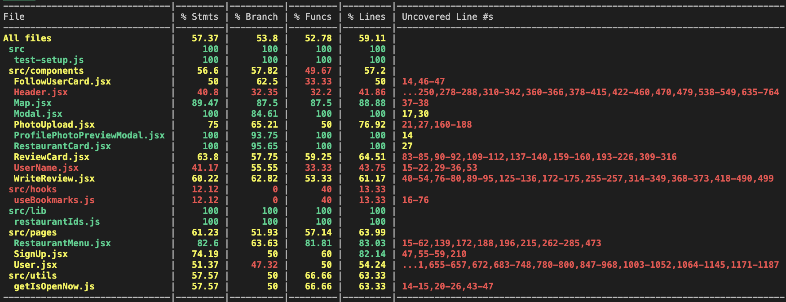
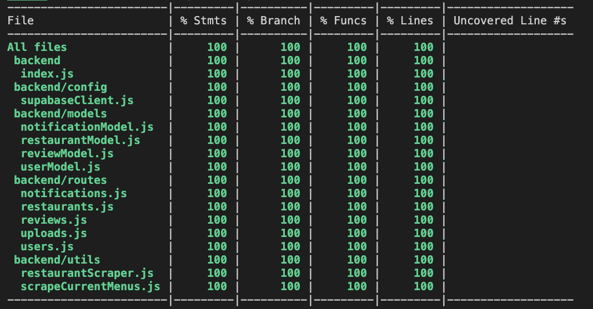

# UMami

## Deployment

### Live App

🌐 [UMami](https://thankful-hill-0f3846d10.7.azurestaticapps.net)

### CI/CD Status

[](https://github.com/Calpoly-Yelp/UMami/actions/workflows/azure-static-web-apps-thankful-hill-0f3846d10.yml)

[](https://github.com/Calpoly-Yelp/UMami/actions/workflows/main_umami-api-calpoly.yml)

[](https://github.com/Calpoly-Yelp/UMami/actions/workflows/ci-testing.yml)

## Running Testing:

```console
npm run test
npm run frontend:test
npm run backend:test
```

## Running Test Coverage & Updating README:

```console
npm run test:coverage
node update-coverage.js
```

## Running Prettier:

```console
npm run format
```

## Running Linter

```console
npm run lint
npm run lint:fix
```

## Running Frontend

```console
npm run frontend:dev
```

## Running Backend

```console
npm run backend:dev
```

## Running Frontend+Backend

```console
npm run dev
```

## Formatting + Linting (Using Prettier and ESLint)

### One-time setup

1. Install dependencies from the repo root:
   - `npm install`
   - `npm --prefix frontend install`
   - `npm --prefix backend install`

2. Install VS Code extensions:
   - **ESLint** (dbaeumer.vscode-eslint)
   - **Prettier – Code formatter** (esbenp.prettier-vscode)

3. VS Code will use the repo’s `.vscode/settings.json` to:
   - format on save (Prettier)
   - auto-fix lint issues on save (ESLint)

## Code Coverage

<!-- Screenshot of Terminal Test Coverage -->




<!-- COVERAGE-START -->

| Project  | Lines  | Statements | Functions | Branches |
| :------- | :----: | :--------: | :-------: | :------: |
| Frontend | 60.11% |   58.16%   |  53.62%   |  52.96%  |
| Backend  | 84.45% |   84.46%   |  79.06%   |  76.13%  |

<!-- COVERAGE-END -->
